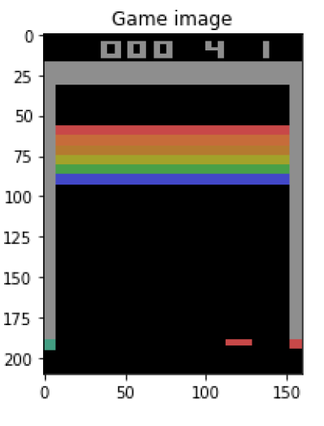
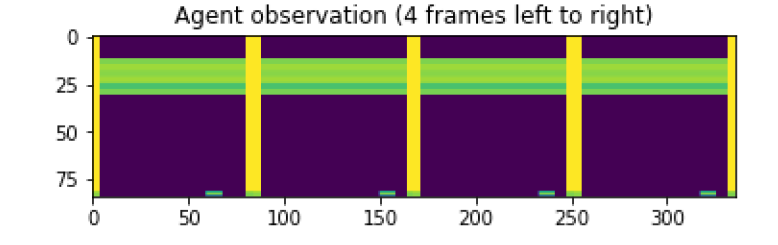
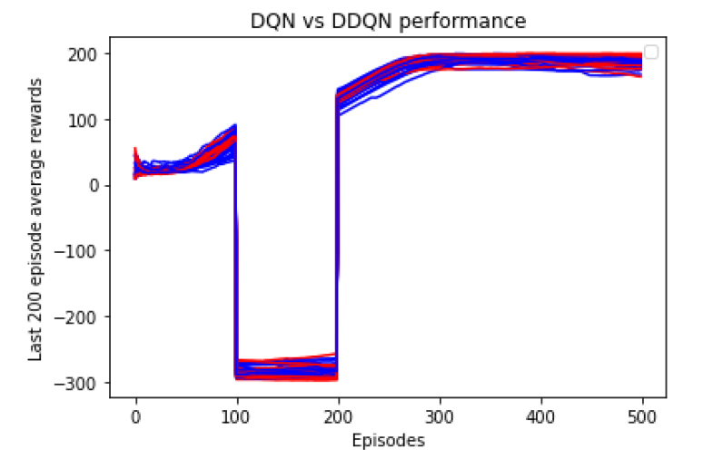
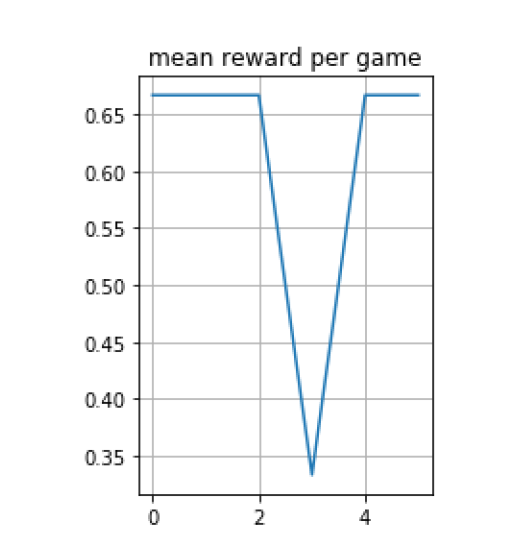

# Reinforcement Learning on CartPole and Atari Environment

So in this project, I have discussed deep q-network and it’s application with breakout Atari and Cartpole-V0 Open Gym environments. And showed the
results of it. And how can I improve the results of it, through increasing the layers of the network or incrementing the networks itself. So to implement it, I
came up with Double and Duel DQN for improving the results. Hence I tested out and showed the results how it goes.

## What I did?

So in this project i have taken cartpole-v0 as the first environment and I have implemented dqn and double dqn in this. I got some good results for dqn for 200 episodes, but for double dqn
I can see the difference in the performance in ddqn and dqn, where ddqn are giving faster cumulative rewards than dqn in fewer episodes.

And in Atari breakout environment, I came up with 2 methods, those are dqn and dueling dqn. So in dueling dqn I got less loss value as compared to dqn.

### Results-: 
   1. Cartpole-: From the below figure you can see that Double dqn outperforms dqn, so average reward for dqn was 198.7 and for ddqn was 199.8.
   
   

   2. Atari Breakout -: In atar breakout there wasn’t that much of a difference in the loss value and the score was almost similar. So scoe for 1100 epochs it was 417, this can be seen in the attached
      video that i have shown. For Dueling loss was-: 0.000126
                               For DQN it was-: 0.000113.
                               From the following graphs you can see the results.
                     
             
        
             

        
